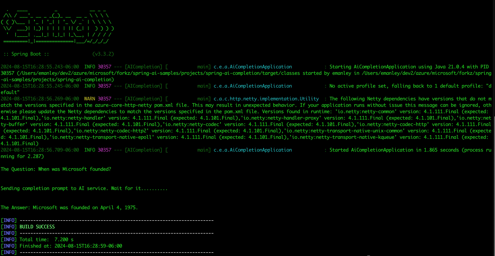

# Spring AI Completion Application Using Azure OpenAI

This project contains a simple java-spring-boot app that will ask a basic question to the Azure OpenAI Service, and return the answer.

## Prerequisite
* Exporting the environment variables is one way to set these configuration properties.

```bash
export SPRING_AI_AZURE_OPENAI_API_KEY="REPLACE_WITH_YOUR_KEY_VALUE_HERE"
export SPRING_AI_AZURE_OPENAI_ENDPOINT="REPLACE_WITH_YOUR_ENDPOINT_HERE"
export SPRING_AI_AZURE_OPENAI_MODEL="REPLACE_WITH_YOUR_MODEL_NAME_HERE"
```

This configuration is compatible with the default settings of the Spring Boot Azure AI Starter and its auto-configuration capabilities.


## Building and running

```
./mvnw spring-boot:run
```

You should see something similiar to:
  


